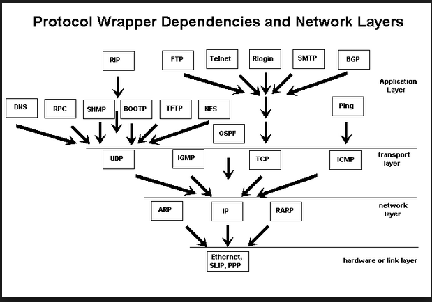
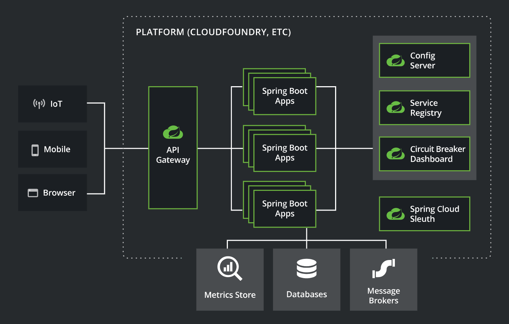
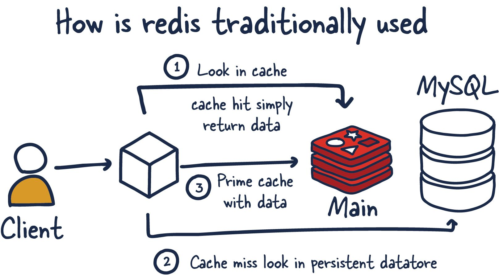
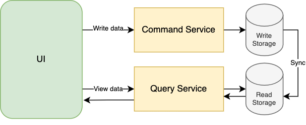
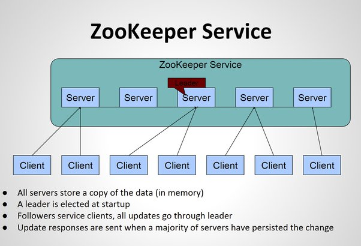
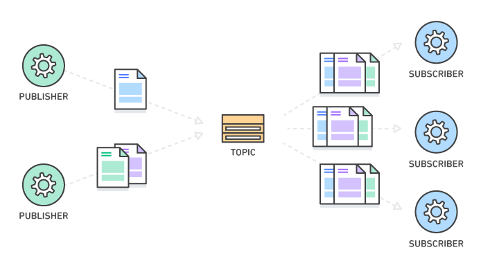
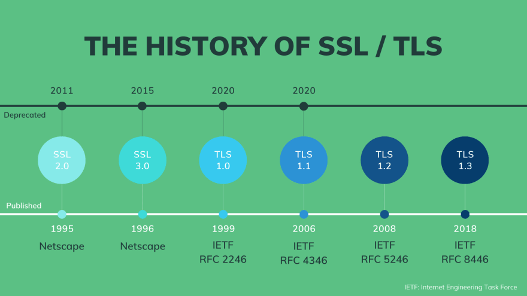

# Software Engineer Relevant Topics

## Data Structures

What Are Data Structures?

Data structure, way in which data are stored for efficient search and retrieval. Different data structures are suited for different problems. 
Some data structures are useful for simple general problems, such as retrieving data that has been stored with a specific identifier. 
For example, an online dictionary can be structured so that it can retrieve the definition of a word.
On the other hand, specialized data structures have been devised to solve complex specific search problems.

Complexity Analysis

Complexity analysis is a way of estimating how much time or space will be used by the algorithm to process large amounts of data. This is done by bounding the behavior above or below by constant multiples of simple functions of the amount of data. Often these are a simple power, like the square, or a logarithm, or the product of the two. Sometimes they are faster growing functions, like 2 to the n.
Sometimes you look at average behavior, sometimes worst case or even best case.
This has come up for me many times, as a way to evaluate approaches, or tune disasterously slow processes. Moving to a new algorithm that had a lower complexity once turned 30 hours of processing increasing rapidly as we got more data to 15 minutes growing slowly. Factor of 100 improvements like that are pretty common.
There are worse cases where time or space grow so fast that only tiny amounts of data can be processed at all.

Memory

Simply memory allocation means: 
 Reserving memory for specific purposes.
 Programs and services are assigned with a specific memory as per their requirements when they are executed. Once the program has finished its operation , the memory is released and allocated to another program or merged within the primary memory.
  Memory allocation has of two types :
 Static Memory Allocation: The program is allocated memory at compile time.
 Dynamic Memory Allocation: The programs are allocated with memory at run time.

Big O Notation

Below are the Big O performance of common functions of different Java Collections.

#### Complexity (Good to Bad)
| Performance | Notation                                       |
|-------------|------------------------------------------------|
| Good        | O(1)       |
| Good        | O(log n)   |
| Fair        | O(n)       |
| Bad         | O(n log n) |
| Bad         | O(n^2)     |
| Bad         | O(2^n)     |
| Bad         | O(n!)      |

| List                 | Add                                      | Remove                                   | Get                                      | Contains                                 | Next                                     | Data Structure |
|----------------------|------------------------------------------|------------------------------------------|------------------------------------------|------------------------------------------|------------------------------------------|----------------|
| ArrayList            | O(1) | O(n) | O(1) | O(n) | O(1) | Array          |
| LinkedList           | O(1) | O(1) | O(n) | O(n) | O(1) | Linked List    |    
| CopyOnWriteArrayList | O(n) | O(n) | O(1) | O(n) | O(1) | Array          |   

Note: h is the table capacity

| Set                   | Add                                          | Remove                                       | Contains                                     | Next                                         | Size                                     | Data Structure           |
|-----------------------|----------------------------------------------|----------------------------------------------|----------------------------------------------|----------------------------------------------|------------------------------------------|--------------------------|
| HashSet               | O(1)     | O(1)     | O(1)     | O(h/n)                                       | O(1) | Hash Table               |
| LinkedHashSet         | O(1)     | O(1)     | O(1)     | O(1)     | O(1) | Hash Table + Linked List |
| EnumSet               | O(1)     | O(1)     | O(1)     | O(1)     | O(1) | Bit Vector               |
| TreeSet               | O(log n) | O(log n) | O(log n) | O(log n) | O(1) | Red-black tree           |
| CopyOnWriteArraySet   | O(n)     | O(n)     | O(n)     | O(1)     | O(1) | Array                    |
| ConcurrentSkipListSet | O(log n) | O(log n) | O(log n) | O(1)     | O(n) | Skip List                |

| Queue                   | Offer                                        | Peak                                     | Poll                                         | Remove                                   | Size                                     | Data Structure |  
|-------------------------|----------------------------------------------|------------------------------------------|----------------------------------------------|------------------------------------------|------------------------------------------|----------------|
| PriorityQueue           | O(log n) | O(1) | O(log n) | O(n) | O(1) | Priority Heap  |
| LinkedList              | O(1)     | O(1) | O(1)     | O(1) | O(1) | Array          |
| ArrayDequeue            | O(1)     | O(1) | O(1)     | O(n) | O(1) | Linked List    |
| ConcurrentLinkedQueue   | O(1)     | O(1) | O(1)     | O(n) | O(n) | Linked List    |
| ArrayBlockingQueue      | O(1)     | O(1) | O(1)     | O(n) | O(1) | Array          |
| PriorirityBlockingQueue | O(log n) | O(1) | O(log n) | O(n) | O(1) | Priority Heap  |
| SynchronousQueue        | O(1)     | O(1) | O(1)     | O(n) | O(1) | None!          |
| DelayQueue              | O(log n) | O(1) | O(log n) | O(n) | O(1) | Priority Heap  |
| LinkedBlockingQueue     | O(1)     | O(1) | O(1)     | O(n) | O(1) | Linked List    |

Note: h is the table capacity

| Map                   | Get                                          | ContainsKey                                  | Next                                         | Data Structure           |
|-----------------------|----------------------------------------------|----------------------------------------------|----------------------------------------------|--------------------------|
| HashMap               | O(1)     | O(1)     | O(h / n)                                     | Hash Table               |
| LinkedHashMap         | O(1)     | O(1)     | O(1)     | Hash Table + Linked List |
| IdentityHashMap       | O(1)     | O(1)     | O(h / n)                                     | Array                    |
| WeakHashMap           | O(1)     | O(1)     | O(h / n)                                     | Hash Table               |
| EnumMap               | O(1)     | O(1)     | O(1)     | Array                    |
| TreeMap               | O(log n) | O(log n) | O(log n) | Red-black tree           |
| ConcurrentHashMap     | O(1)     | O(1)     | O(h / n)                                     | Hash Tables              |
| ConcurrentSkipListMap | O(log n) | O(log n) | O(1)     | Skip List                |

Logarithm

The binary logarithm function may be defined as the inverse function to the power of two function, which is a strictly increasing function over the positive real numbers and therefore has a unique inverse. 
 Alternatively, it may be defined as ln n/ln 2, where ln is the natural logarithm, defined in any of its standard ways. 
 Using the complex logarithm in this definition allows the binary logarithm to be extended to the complex numbers.

As with other logarithms, the binary logarithm obeys the following equations, which can be used to simplify formulas that combine binary logarithms with multiplication or exponentiation:

Arrays

[Arrays - Java Documentation](https://docs.oracle.com/javase/8/docs/api/java/util/Arrays.html)

|  Action   |                 Average                  |                  Worst                   |
|:---------:|:----------------------------------------:|:----------------------------------------:|
|  Access   | O(1) | O(1) |
|  Search   | O(n) | O(n) |
| Insertion | O(n) | O(n) |
| Deletion  | O(n) | O(n) |

| Space Complexity | O(n) |
|:----------------:|:----------------------------------------:|

Linked Lists

[Linked Lists - Java Documentation](https://docs.oracle.com/javase/8/docs/api/java/util/LinkedList.html)

#### Singly-Linked List
|  Action   |                 Average                  |                  Worst                   |
|:---------:|:----------------------------------------:|:----------------------------------------:|
|  Access   | O(n) | O(n) |
|  Search   | O(n) | O(n) |
| Insertion | O(1) | O(1) |
| Deletion  | O(1) | O(1) |

| Space Complexity | O(n) |
|:----------------:|:----------------------------------------:|

#### Doubly-Linked List
|  Action   |                 Average                  |                  Worst                   |
|:---------:|:----------------------------------------:|:----------------------------------------:|
|  Access   | O(n) | O(n) |
|  Search   | O(n) | O(n) |
| Insertion | O(1) | O(1) |
| Deletion  | O(1) | O(1) |

| Space Complexity | O(n) |
|:----------------:|:----------------------------------------:|

#### Skip List
|  Action   |                   Average                    |                  Worst                   |
|:---------:|:--------------------------------------------:|:----------------------------------------:|
|  Access   | O(log n) | O(n) |
|  Search   | O(log n) | O(n) |
| Insertion | O(log n) | O(n) |
| Deletion  | O(log n) | O(n) |

| Space Complexity | O(n log n) |
|:----------------:|:----------------------------------------------:|

Hash Tables

[Hash Tables - Java Documentation](https://docs.oracle.com/javase/8/docs/api/java/util/Hashtable.html)

|  Action   |                 Average                  |                  Worst                   |
|:---------:|:----------------------------------------:|:----------------------------------------:|
|  Access   |                   N/A                    |                   N/A                    |
|  Search   | O(1) | O(n) |
| Insertion | O(1) | O(n) |
| Deletion  | O(1) | O(n) |

| Space Complexity | O(n) |
|:----------------:|:----------------------------------------:|

Stacks

[Stacks - Java Documentation](https://docs.oracle.com/javase/8/docs/api/java/util/Stack.html)

|  Action   |                 Average                  |                  Worst                   |
|:---------:|:----------------------------------------:|:----------------------------------------:|
|  Access   | O(n) | O(n) |
|  Search   | O(n) | O(n) |
| Insertion | O(1) | O(1) |
| Deletion  | O(1) | O(1) |

| Space Complexity | O(n) |
|:----------------:|:----------------------------------------:|

Queues

[Queues - Java Documentation](https://docs.oracle.com/javase/8/docs/api/java/util/Queue.html)

|  Action   |                 Average                  |                  Worst                   |
|:---------:|:----------------------------------------:|:----------------------------------------:|
|  Access   | O(n) | O(n) |
|  Search   | O(n) | O(n) |
| Insertion | O(1) | O(1) |
| Deletion  | O(1) | O(1) |

| Space Complexity | O(n) |
|:----------------:|:----------------------------------------:|

Strings

[Strings - Java Documentation](https://docs.oracle.com/javase/8/docs/api/java/lang/String.html)

[Strings - Baeldung](https://www.baeldung.com/java-string)

Graphs

[Graphs - Baeldung](https://www.baeldung.com/java-graphs)

Trees

[Trees - Java Documentation](https://docs.oracle.com/javase/8/docs/api/javax/swing/tree/TreeNode.html)

#### B-Tree
|  Action   |                   Average                    |                  Worst                   |
|:---------:|:--------------------------------------------:|:----------------------------------------:|
|  Access   | O(log n) | O(n) |
|  Search   | O(log n) | O(n) |
| Insertion | O(log n) | O(n) |
| Deletion  | O(log n) | O(n) |

| Space Complexity | O(n) |
|:----------------:|:----------------------------------------:|

#### Cartesian Tree
|  Action   |                   Average                    |                  Worst                   |
|:---------:|:--------------------------------------------:|:----------------------------------------:|
|  Access   |                     N/A                      |                   N/A                    |
|  Search   | O(log n) | O(n) |
| Insertion | O(log n) | O(n) |
| Deletion  | O(log n) | O(n) |

| Space Complexity | O(n) |
|:----------------:|:----------------------------------------:|

#### B+ Tree
|  Action   |                   Average                    |                    Worst                     |
|:---------:|:--------------------------------------------:|:--------------------------------------------:|
|  Access   | O(log n) | O(log n) |
|  Search   | O(log n) | O(log n) |
| Insertion | O(log n) | O(log n) |
| Deletion  | O(log n) | O(log n) |

| Space Complexity | O(n) |
|:----------------:|:----------------------------------------:|

#### Red-Black Tree
|  Action   |                   Average                    |                    Worst                     |
|:---------:|:--------------------------------------------:|:--------------------------------------------:|
|  Access   | O(log n) | O(log n) |
|  Search   | O(log n) | O(log n) |
| Insertion | O(log n) | O(log n) |
| Deletion  | O(log n) | O(log n) |

| Space Complexity | O(n) |
|:----------------:|:----------------------------------------:|

#### Splay Tree
|  Action   |                   Average                    |                  Worst                   |
|:---------:|:--------------------------------------------:|:----------------------------------------:|
|  Access   |                     N/A                      |                   N/A                    |
|  Search   | O(log n) | O(n) |
| Insertion | O(log n) | O(n) |
| Deletion  | O(log n) | O(n) |

| Space Complexity | O(n) |
|:----------------:|:----------------------------------------:|

#### AVL Tree
|  Action   |                   Average                    |                    Worst                     |
|:---------:|:--------------------------------------------:|:--------------------------------------------:|
|  Access   | O(log n) | O(log n) |
|  Search   | O(log n) | O(log n) |
| Insertion | O(log n) | O(log n) |
| Deletion  | O(log n) | O(log n) |

| Space Complexity | O(n) |
|:----------------:|:----------------------------------------:|

#### KD Tree
|  Action   |                   Average                    |                  Worst                   |
|:---------:|:--------------------------------------------:|:----------------------------------------:|
|  Access   | O(log n) | O(n) |
|  Search   | O(log n) | O(n) |
| Insertion | O(log n) | O(n) |
| Deletion  | O(log n) | O(n) |

| Space Complexity | O(n) |
|:----------------:|:----------------------------------------:|

## Systems Design Fundamentals

Client Server Model

<strong>What is a Client?</strong>

A client is a computer hardware device or software that accesses a service made available by a server. The server is often (but not always) located on a separate physical computer.

<strong>What is a Server?</strong>

A server is a physical computer dedicated to run services to serve the needs of other computers. Depending on the service that is running, it could be a file server, database server, home media server, print server, or web server.
 

Network Protocols

[Network Protocols - Baeldung](https://www.baeldung.com/cs/popular-network-protocols)

Storage

PostgreSQL example 

Latency And Throughput

Latency is the time required to perform some action or to produce some result. Latency is measured in units of time -- hours, minutes, seconds, nanoseconds or clock periods.

 Throughput is the number of such actions executed or results produced per unit of time. This is measured in units of whatever is being produced (cars, motorcycles, I/O samples, memory words, iterations) per unit of time. The term "memory bandwidth" is sometimes used to specify the throughput of memory systems.
 

Availability

Caching

Proxies

NGINX Reverse Proxy 
 

Load Balancers

Hashing

[What is Consistent Hashing and Where is it used?](https://www.youtube.com/watch?v=zaRkONvyGr8)

[Learn hashing and consistent hash ring](https://www.youtube.com/watch?v=bBK_So1u9ew)

Relational Databases

Key-Value Stores

[Redis](https://redis.io/) is a good example of key-value store
 

Specialized Storage Paradigms

Blob Storages: Google Cloud Storage or S3
 Time Series Database: InfluxDB or Prometheus
 Graph Database: Neo4j cypher language
 Spatial Database: Quadtree

Replication And Sharding

Database sharding:
 

Database scale:
 

Leader Election

Zookeeper:
 

Peer-To-Peer Networks

Polling And Streaming

[Polling And Streaming - Explanation](https://www.youtube.com/watch?v=rHOHOt7oz-4)

Configuration

Rate Limiting

[Secure Rate Limiting with Spring Cloud Gateway](https://piotrminkowski.com/2021/05/21/secure-rate-limiting-with-spring-cloud-gateway/)

Logging And Monitoring

Splunk:
 

Splunk alert to Slack
 

Grafana:
 

Publish/Subscribe Pattern

Spring Kafka:
 

MapReduce

[Hadoop](https://hadoop.apache.org/)

[MapReduce whitepaper](https://static.googleusercontent.com/media/research.google.com/pt-BR//archive/mapreduce-osdi04.pdf)

[MapReduce - Computerphile](https://www.youtube.com/watch?v=cvhKoniK5Uo)

Security And HTTPS

HTTP and HTTPS:
 

SSL and TLS handshake process:
 

SSL and TLS history:
 

SSL and TLS:
 

API Design

Spring:
 

Endpoints:
 

